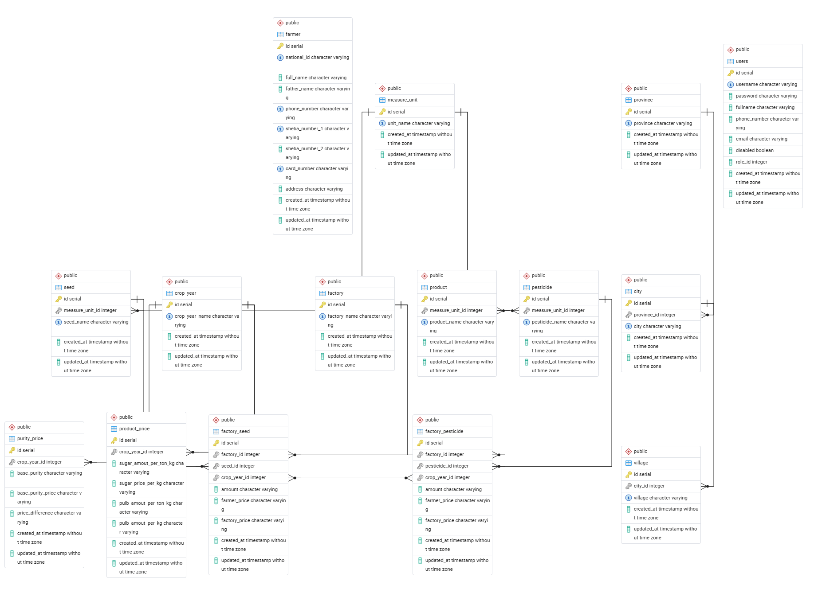
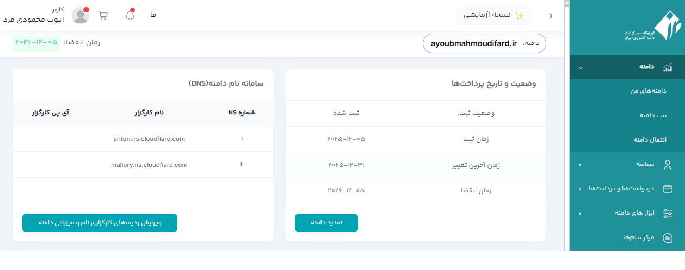
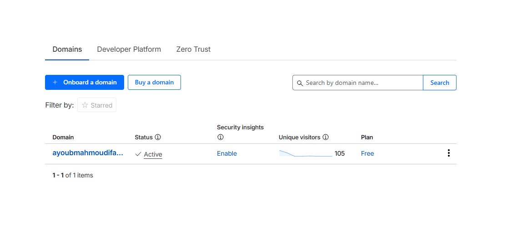
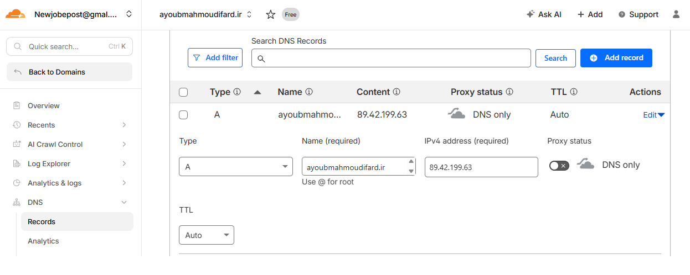

# گزارش پروژه پایانی درس پایگاه داده پیشرفته

**دانشجو:** ایوب محمودی فرد
**درس:** پایگاه داده پیشرفته
**استاد:** دکتر آرمین رشنو

## معرفی پروژه

هدف نوشتن وب سرویس مبتنی بر FastAPI طراحی و پیاده‌سازی شده است که عملیات مرتبط با پایگاه داده را به‌صورت API در بستر وب ارائه می‌دهد. 
در پایان این پروژه با GitHub و مباحث API و ساختار بانک اطلاعاتی رابطه ایی و همچنین مدیریت دامنه و مدیریس سرور آشنا می شویم.

## مرحله ۱

از طریق محیط Swagger همه API های سمت سرور بررسی شده و هر کدام تست شوند.
لیست همه API ها در یک جدول شامل نام، ورودی، خروجی مستند سازی شود.

[دانلود فایل PDF](document/step-01.pdf)

## مرحله ۲

همه صفحات سمت کاربر بررسی شود و مشخص کنید هر صفحه کدام API را فراخوانی میکند. در این
مرحله تسلط کافی بر تب های مختلف Inspect مرورگر لازم است.
در این گام با نحوه بررسی ارتباط مرورگر کاربر با سرور آشنا می شویم.

[دانلود فایل PDF](document/step-02.pdf)

## مرحله ۳

لیست همه جداول، فیلدهای هر جدول و ارتباطات بین جداول در اختیار شما قرار داده می شود. یک پایگاه
داده رابطه ای را پیاده سازی کنید.
بانک اطلاعاتی این پروژه با بانک اطلاعاتی postgres طراحی شده و در آن کلید های اصلی و خارجی و همچنین ارتباط ها و نوع آنها مشخص شده

## مرحله ۵

همه عملیات موجود در پایگاه داده رابطه ای و غیررابطه ای را در قالب یک وب سرویس بصورت API ایجاد
کنید.
تمامی مسیرهای API ها درون پوشه app و زیر مجموعه آن یعنی پوشه router قرار دارند.
در این پروژه برای هر فایل سه پوشه قرار داده شده که یکی برای قرار گرفتن شما ها و یکی برای قرار گرفتن مسیرها و یکی نیز برای قرار گرفتن مدل های بانک اطلاعاتی وجود دارد.

## مرحله ۶

در این مرحله یک دامنه با پسوند `.ir` به نام زیر از سایت ایرنیک تهیه گردید:

- **Domain:** `ayoubmahmoudifard.ir`

سپس:

- یک حساب کاربری در Cloudflare ایجاد شد
- سپس Nameserver های Cloudflare به دامنه منتقل گردید.
- در آخر رکورد های DNS برای اتصال به IP سرور تنظیم شد.

## مرحله ۷

یک سرور مجازی لینوکسی را برای بازه کوتاهی اجاره کنید یا از ارایه دهنده سرورهای رایگان مانند لیارا , یا ... استفاده شود.

برای اجرای پروژه، یک سرور لینوکسی (Ubuntu) از ارائه‌دهنده لیارا تهیه شد.

مشخصات کلی:

- سیستم عامل: Ubuntu
- وب سرور: Nginx
- اجرای API با: FastAPI + Uvicorn

بعد از تهیه سرور سورس کد پروژه از روی گیت بر روی سرور کلون شد
دسترسی به سرور از طریق SHH در محیط ویرایشگر کد Visual Studio Code (VS code) صورت گرفت
و سپس تمامی برنامه های مورد نیاز از طریق ترمینال این بخش بر روی سرور نصب و راه اندازی گردید.

## مرحله ۸

از طریق بستر Github یا فایل های سورس پروژه را از IDE به Repository خود Push کنید و بر روی
سرور خود Clone کنید.
تمامی این موارد انجام شد و سروس کد با دستورات گیت از محیط لوکار به محیط کیت هاب قرار گرفت
برای این کار در محیط Git یک ریپازیتوری جدید برای پروژه ایجاد و پروژه بر روی آن Push شد

## مرحله ۹

پروژه را بر روی سرور مستقر کنید، سپس برای دامنه خود گواهی SSL دریافت و نصب نمایید. در نهایت،
اطمینان حاصل کنید که برنامه از طریق HTTPS بهصورت ایمن در دسترس است.

پس از استقرار کامل پروژه، برای دامنه گواهی SSL دریافت و نصب شد.

## مرحله ۱۰

از طریق بستر CI/CD فرایند اجرا بر روی سرور را خودکار کنید . به این معنی که بعد از اعمال هر تغییری
در لوکال هاست و پوش کردن آن در گیت هاب ، تغییرات همان لحظه بر روی سرور اعمال شود.

در این مرحله فرآیند CI/CD پیاده‌سازی شد به‌طوری که:

- با هربار push جدید به Github
- تغییرات بصورت خودکار اعمال میشوند
- نیاز به Deploy دستی حذف شد.

## مرحله ۱۱

یک دستیار مبتنی بر هوش مصنوعی طراحی کنید که در مورد محتوی پایگاه داده از آن سوال
پرسیده شود و بتواند به سواالت پاسخ دهد.
برای این بخش از سرویس های ارائه دهنده مدل هوش مصنوعی مانند سایت لیارا یک وب سرویس مدل هوش مصنوعی ChatGPT تهیه شد و سپس با استفاده از کلید API از طریق Router ایجاد شده به اسم AI درون FastAPI
به این مدل وصل شده و جهت آموزش آن. از بانک اطلاعاتی شهر و استان یک دستور برای جمع آوری و وصل کردن جداول با استفاده از کلید اصلی و کلید خارجی استفاده شد و سپس خروجی آن به صورت متنی به مدل ارائه شد و سپس از مدل خواستم
که از این داده ها به کاربران جواب بدهد.

## مرحله ۱۲

گزارشی از جزئیات همه مراحل فوق به همراه عکس هر مرحله آماده کرده و در فایل README.md قرار
دهید.
